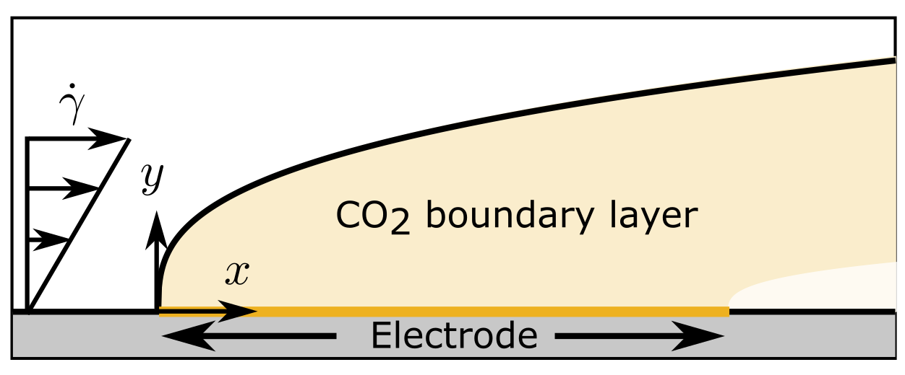
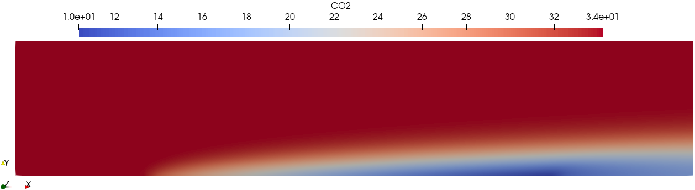

Flow reactor for CO2 electrolysis
=================================

We consider a flowing bicarbonate elecrolyte with CO2 reduction on a flat plate
electrode.

We consider simplified CO2 - KHCO3 homogeneous reactions:

.. math::

   \ce{CO2} + \ce{OH-} \xrightleftharpoons[k_1^b]{k_1^f} \ce{HCO3-}

   \ce{HCO3-} + \ce{OH-} \xrightleftharpoons[k_2^b]{k_2^f} \ce{CO3^2+} + \ce{H2O}

where :math:`k_i^f` and :math:`k_i^b` are the forward and backward rate constants, respectively.
Here, we assume the dilute solution case where :math:`\ce{H2O}`
concentration is not tracked. 

We are solving for :math:`c_k`, the molar concentration of species
:math:`k\in\{\ce{CO2}, \ce{HCO3-}, \ce{CO3^2+}, \ce{OH-},
\ce{K+}\}`,
as well as :math:`\Phi_2`, the ionic potential.
For each species :math:`k`, the conservation of mass is given by

.. math::

   \nabla \cdot \mathbf{N}_k = R_k,

where :math:`\mathbf N_k` and :math:`R_k` are the flux and homogeneous
reactions for species :math:`k`, respectively The flux term is given by the
Nernst-Planck equation, which includes diffusion, advection, and
electromigration:

.. math::

   \mathbf N_k = -D_k \nabla c_k + c_k \mathbf u - z_k F \frac{D_k}{RT} c_k \nabla \Phi_2,

where :math:`D_k` is the diffusion coefficient of species :math:`k`, and
:math:`z_k`, its charge number, :math:`\mathbf{u}` is the velocity, :math:`F`
is the Faraday constant, :math:`R` is the ideal gas constant, :math:`T` is the
temperature. We assume shear flow such that the velocity field is given by
:math:`\mathbf{u} = (\dot \gamma y, 0)`, where :math:`\dot\gamma` is the shear rate and
:math:`y` is the distance from the electrode.

We assume the electroneutrality approximation such that

.. math::

        \sum_k z_k c_k = 0.

The are five charge-transfer reactions at the surface of the electrode

.. math::

   \ce{CO2} + \ce{H2O} + 2\ce{e-} \rightleftharpoons \ce{HCOO-} + \ce{OH-}

   \ce{CO2} + \ce{H2O} + 2\ce{e-} \rightleftharpoons \ce{CO} + 2\ce{OH-}

   \ce{CO2} + 6\ce{H2O} + 8\ce{e-} \rightleftharpoons \ce{CH4} + 8\ce{OH-}

   2\ce{CO2} + 8\ce{H2O} + 12\ce{e-} \rightleftharpoons \ce{C2H4} + 12\ce{OH-}

   2\ce{H2O} + 2\ce{e-} \rightleftharpoons \ce{H2} + 2\ce{OH-}

Note that we ignore the transport of products other than :math:`\ce{OH-}`. For each
reaction :math:`j`, we assume a constant current density :math:`i_j`, such that
the normal flux at the electrode surface is given by

.. math::

    \mathbf{N}_k \cdot \mathbf n = -\sum_j \frac{s_{k,j} i_j}{n_j F},

where :math:`s_{k,j}` is the stoichiometry coefficient for the species
:math:`k` in reaction :math:`j`, and :math:`n_j` is the number of electrons
transferred. The partial current density is given by :math:`i_j= \mathrm{cef}_j
i_\mathrm{tot}`, where :math:`\mathrm{cef}_j` is the current efficiency of
reaction :math:`j` and :math:`i_\mathrm{tot}` is the total current. 

At the inlet, the boundary condition for each species :math:`k` is

.. math::

    \mathbf N_k \cdot \mathbf n = c_{k,\mathrm{bulk}} \mathbf u \cdot \mathbf n,

where :math:`c_{k,\mathrm{bulk}}` is the bulk concentration, and at the outlet

.. math::

    \mathbf N_k \cdot \mathbf n = c_k \mathbf u \cdot \mathbf n.

At the top boundary, i.e. the bulk, the ionic potential is set to a reference
value :math:`\Phi_2=0`, and a no-flux condition is set for all species. A no
flux-condition is also set on the walls with no electrode, as well as on the
electrode for the species that are not reacting there.

The species parameters, homogeneous bulk reactions, and the constant-rate
charge-transfer kinetics are taken from :cite:`gupta2006calculation`.
For this demo, we will use SI units. EchemFEM has no notion of units and the
user simply must provide consistent units.

We import the required packages::

    from firedrake import *
    from echemfem import EchemSolver, RectangleBoundaryLayerMesh

Then, we create our own child class of :py:class:`EchemSolver <echemfem.EchemSolver>`::

    class GuptaSolver(EchemSolver):
        def __init__(self):
        
We now define a rectangular mesh with added refinement in a thin boundary layer
along the electrode boundary using :py:func:`RectangleBoundaryLayerMesh <echemfem.utility_meshes.RectangleBoundaryLayerMesh>`. The
channel is of width 1 mm and length 5 mm. We have 100 elements in the length
direction. In the width direction, there are 50 elements in the first
micrometer and 50 elements for the rest. The local refinement is meant to
capture the thin :math:`\ce{OH-}` boundary layer. The electrode is on the
bottom boundary, which has boundary marker 3::

            Ly = 1e-3 # m
            Lx = 5e-3 # m
            mesh = RectangleBoundaryLayerMesh(100, 50, Lx, Ly, 50, 1e-6, boundary=(3,))

For numerical reasons, we do not want the electrode boundary to be right next
to the inlet and outlet regions. We will have 1 mm of inactive wall before and
after the electrode. One easy way to do this for Neumann boundaries is to
define an indicator function for the electrode using spatial coordinates and
conditional given by Firedrake/UFL::

            x, y = SpatialCoordinate(mesh)
            active = conditional(And(x >= 1e-3, x < Lx-1e-3), 1., 0.)

We create a list with parameters for all species. Each entry in the list is a
dictionary containing the name, the diffusion coefficient, the bulk
concentration, and charge number of a species::

            conc_params = []

            conc_params.append({"name": "CO2",
                                "diffusion coefficient": 19.1e-10,  # m^2/s
                                "bulk": 34.2,  # mol/m3
                                "z": 0,
                                })

            conc_params.append({"name": "HCO3",
                                "diffusion coefficient": 9.23e-10,  # m^2/s
                                "bulk": 499.,  # mol/m3
                                "z": -1,
                                })

            conc_params.append({"name": "CO3",
                                "diffusion coefficient": 11.9e-10,  # m^2/s
                                "bulk": 7.6e-1,  # mol/m3
                                "z": -2,
                                })

            conc_params.append({"name": "OH",
                                "diffusion coefficient": 52.7e-10,  # m^2/s
                                "bulk": 3.3e-4,  # mol/m3
                                "z": -1,
                                })

            conc_params.append({"name": "K",
                                "diffusion coefficient": 19.6E-10,  # m^2/s
                                "bulk": 499. + 7.6e-1 + 3.3e-4,  # mol/m3
                                "z": 1,
                                })

Similarly, we provide a list containing the parameters for the homogeneuous
reactions. Each entry is a dictionary for one reaction containing: a dictionary
with the stoichiometry of all reactants (negative) and all products (positive),
and rate constants::

            homog_params = []

            homog_params.append({"stoichiometry": {"CO2": -1,
                                                   "OH": -1,
                                                   "HCO3": 1,
                                                   },
                                 "forward rate constant": 5.93, # m3/mol/s
                                 "backward rate constant": 1.34e-4 # 1/s
                                 })

            homog_params.append({"stoichiometry": {"HCO3": -1,
                                                   "OH": -1,
                                                   "CO3": 1,
                                                   },
                                 "forward rate constant": 1e5, # m3/mol/s
                                 "backward rate constant": 2.15e4 # 1/s
                                 })

For convenience, we write a function that will return the current density
function for each charge-transfer reaction. To have zero-flux on the inactive
walls, we multiply by our indicator function. Since the currents are constant,
the argument is unused::

            def current(cef):
                j = 50. # A/m2
                def curr(u):
                    return cef * j * active
                return curr 

We create a list for the parameters of the charge-transfer reactions where each
entry is a dictionary associated with a reaction. For the key ``"reaction"`` we
provide a function that returns the partial current density of the reaction.
The stoichiometry is provided similarly to ``homog_params``. We also provide
the number of electrons transferred and name the boundary where the reaction
happens::

            echem_params = []

            echem_params.append({"reaction": current(0.1), # HCOO
                                 "stoichiometry": {"CO2": -1,
                                                   "OH": 1
                                                   },
                                 "electrons": 2,
                                 "boundary": "electrode",
                                 })

            echem_params.append({"reaction": current(0.05), # CO
                                 "stoichiometry": {"CO2": -1,
                                                   "OH": 2
                                                   },
                                 "electrons": 2,
                                 "boundary": "electrode",
                                 })

            echem_params.append({"reaction": current(0.25), # CH4
                                 "stoichiometry": {"CO2": -1,
                                                   "OH": 8
                                                   },
                                 "electrons": 8,
                                 "boundary": "electrode",
                                 })

            echem_params.append({"reaction": current(0.2), # C2H4
                                 "stoichiometry": {"CO2": -2,
                                                   "OH": 12
                                                   },
                                 "electrons": 12,
                                 "boundary": "electrode",
                                 })

            echem_params.append({"reaction": current(0.4), # H2
                                 "stoichiometry": {"OH": 2
                                                   },
                                 "electrons": 2,
                                 "boundary": "electrode",
                                 })

Most physical parameters that are not associated with species or reaction are
passed through the ``physical_params`` argument in a dictionary. The ``"flow"`` key
is given a list of the desired transport mechanisms. The other parameters are
physical constants described above::

            physical_params = {"flow": ["diffusion", 
                                        "electroneutrality",
                                        "migration",
                                        "advection"],
                               "F": 96485.3329,  # C/mol
                               "R": 8.3144598,  # J/K/mol
                               "T": 273.15 + 25.,  # K
                               }

The parameters and the mesh are passed to the initiator of parent class
:py:class:`EchemSolver <echemfem.EchemSolver>`. The optional argument ``family``
sets the finite element space; here, ``"CG"`` stands for continuous Galerkin,
which is usually the fastest option, whereas ``"DG"`` stands for discontinuous Galerkin, which can provide more stability for advection-dominated cases::

            super().__init__(conc_params, physical_params, mesh, family="CG",
                             echem_params=echem_params,
                             homog_params=homog_params)

The boundary conditions are set through this abstract method, which the user always needs to specify. Note that the name ``"electrode"`` only has meaning because it is provided in ``echem_params``. Also note that the "natural" boundary condition for this finite element formulation is no-flux, so it is the default boundary condition::

        def set_boundary_markers(self):
            self.boundary_markers = {"inlet": (1,),
                                     "outlet": (2,),
                                     "bulk": (4,),
                                     "electrode": (3,),
                                     }

Similarly, the velocity field is set through an abstract method::

        def set_velocity(self):
            _, y = SpatialCoordinate(self.mesh)
            self.vel = as_vector([1.91*y, Constant(0)])  # m/s

Finally, we create our solver object, set up the solver, and run it::

    solver = GuptaSolver()
    solver.setup_solver()
    solver.solve()

The solution fields can be visualized by opening ``results/collection.pvd``
using Paraview. For example, the :math:`\ce{CO2}` solution field:

This demo can be found as a script :download:`here <flow_reactor.py>`

.. rubric:: References

.. bibliography:: demo_references.bib
   :filter: docname in docnames
